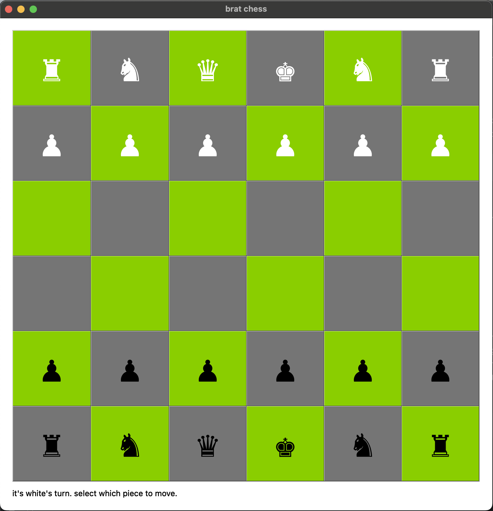

# crazy chess simulator: brat chess

katy stuparu


## how to run
1. install python (i am using 3.9.6, but other versions probably work).
2. install the `PyQt5` python package. you can do this with a virtual environment.
```shell
$ python -m venv venv
$ . venv/bin/activate
(venv) $ pip install -r requirements.txt
```
3. now, you should be able to run the code. a window should pop up with the chess board.
```shell
(venv) $ python brat_chess.py
```


## how to play
1. read the directions at the bottom of the window. it will tell you whose turn it is and indicate the game state.
2. click on a valid piece to move. a valid piece is any piece of the correct color that has potential next moves. if a 
piece doesn't have next moves (because it's blocked by other pieces, for example), you won't be able to click on it.
3. next, click on the spot you would like to move the piece to. see the rules below to understand how pieces move.
4. after clicking on a valid next spot, it is the next player's turn.
5. continue until one of the kings is eliminated!

## game rules
1. king: kings can only move one block to the left or to the right
2. queen: queens can move anywhere within a three block radius
3. knight: knights move two blocks up, down, left, or right
4. rook: rooks swap places with any game piece of the same color
5. pawn: pawns only move one block up or down (and do not turn into queens)
6. all pieces can eliminate a piece of the opposite color, or move to an empty space. a rook can only swap places with 
pieces of the same color.